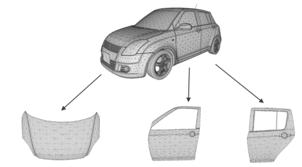
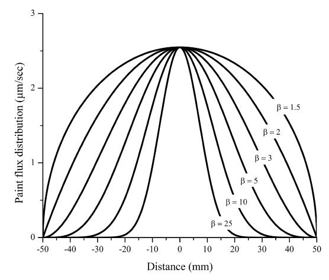
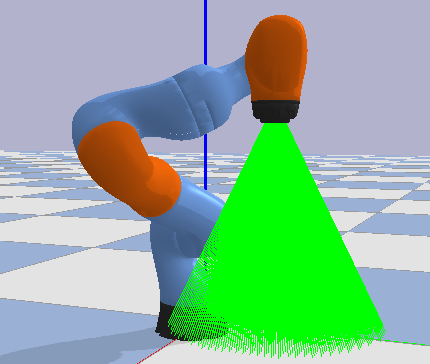
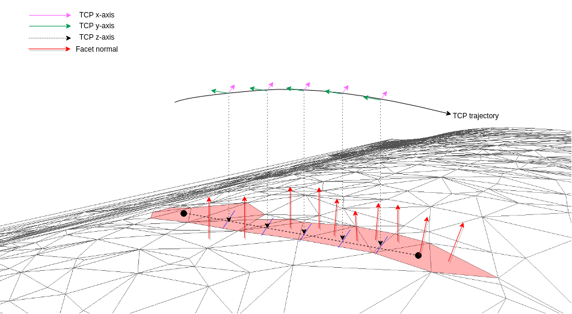
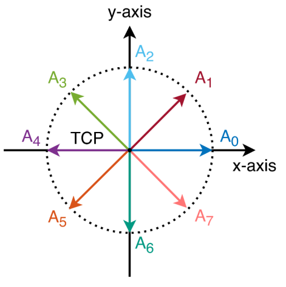
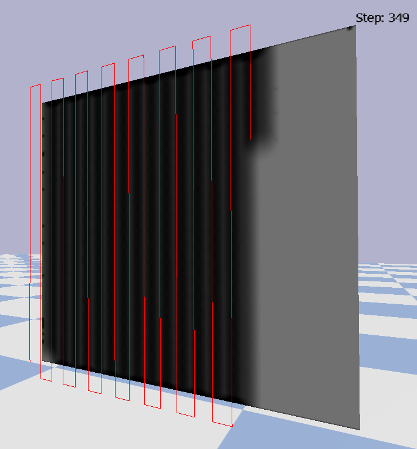

----

<a name="toc"/>

<a href="#abstract">Abstract</a> &middot;
<a href="#motivation">Motivation</a> &middot;
<a href="#data_generation">Data generation</a> &middot;
<a href="#simulation">Simulation</a> &middot;
<a href="#experiments">Experiments</a> &middot;
<a href="#results">Results</a> &middot;
<a href="#transfer">Sim2real transfer </a>

----

<a name="abstract"/>
## Abstract <a href="#toc" class="top-link">[Top]</a>

We present PaintRL, a framework that enables research on optimizing industrial spray painting for arbitrary objects with reinforcement learning. PaintRL implements a toolkit to simulate and visualize spray painting based on the physics engine PyBullet. By means of this toolkit, we train neural networks to predict coverage paths and evaluate the results on two objects: a quadratic sheet and a real car door. Our initial results show that the generated coverage path of the car door performs on a par with a manually implemented zigzag baseline. To allow sim2real transfer for non-resettable tasks like spray painting, we replace paint by light using projection mapping. This approach opens up new possibilities to visualize the results from simulation, collect human demonstrations and capture real-world images. PaintRL is part of our endeavor to utilize the recent advances in deep reinforcement learning for economically important industrial tasks.

<a name="motivation"/>
## Motivation <a href="#toc" class="top-link">[Top]</a>

Industry 4.0 requires flexible line production. However, teaching of the robot trajectory is a trial and error process which relies heavily on the experience of the domain experts. Hence, reinforcement learning is used to

+ avoid manual programming for each individual part
+ allow product customizations

Case of application: Spray painting

  

<a name="data_generation"/>
## Data Generation <a href="#toc" class="top-link">[Top]</a>

We address the challenging task to collect training data for industrial tasks by
+ developing a fast and scalable spray painting simulation
+ replacing paint with light to collect real-world data

<a name="simulation"/>
## Spray painting simulation <a href="#toc" class="top-link">[Top]</a>

+ The paint flux of a spray gun is modeled by a beta distribution

  

+ Impact points of paint droplets are calculated with ray-surface intersection tests provided by PyBullet

  

+ The robot moves orthogonally to the surface normals of the workpiece

  

<a name="experiments"/>
## Experiments <a href="#toc" class="top-link">[Top]</a>

The coverage path planning is formalized as a markov decision process (S, A, Pa, Ra)

### Observation:

+ Pose of the spray gun
+ Ratios of unpainted pixels and total pixels for circular sectors around the spray gun

  

### Actions:

+ Discrete actions which control the direction of the robot movement

  

### Reward:

+ Number of newly painted pixels
+ Time penalty
+ Optional overlap penalty

### Baseline:

+ Quadratic sheet
+ Zigzag pattern

  

<a name="results"/>
## Results <a href="#toc" class="top-link">[Top]</a>

+ Generated path leads to full paint coverage of a car door
+ Time equivalent to baseline

**Figure of the results, video capture of the rollout**

<a name="transfer"/>
## Sim2real transfer  <a href="#toc" class="top-link">[Top]</a>

Projection mapping opens up new possibilities to:

+ visualize the results from simulation
+ collect human demonstrations
+ capture real-world images

  <iframe width="1280" height="720" src="https://www.youtube-nocookie.com/embed/nJVLpEk1MOs?rel=0" frameborder="0" allow="accelerometer; autoplay; encrypted-media; gyroscope; picture-in-picture" allowfullscreen></iframe>

