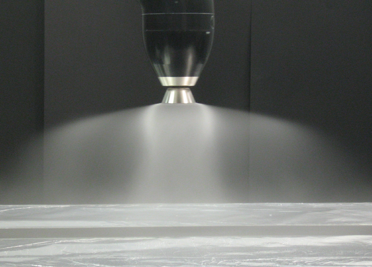
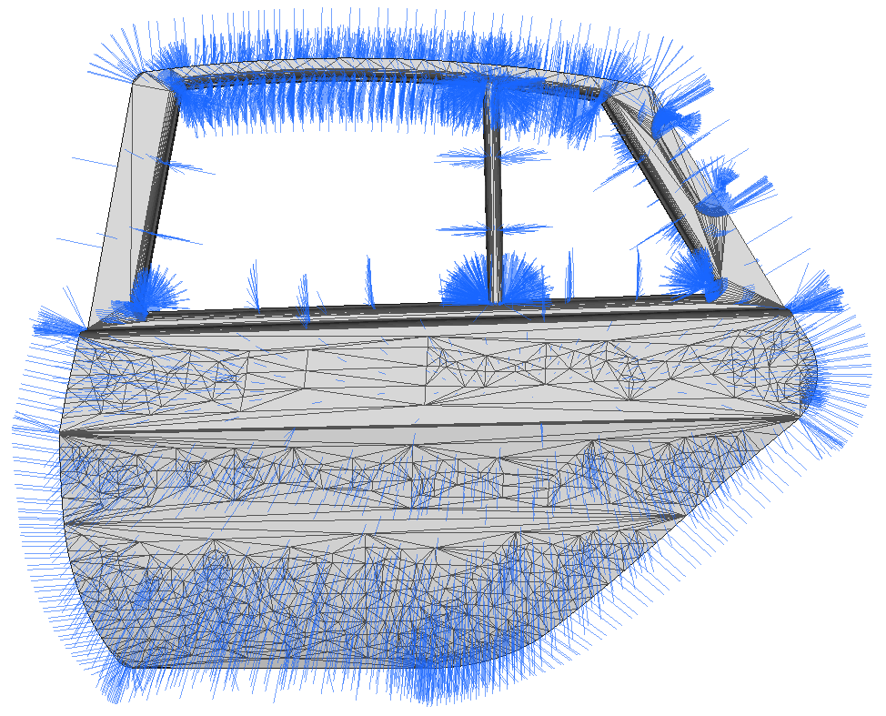
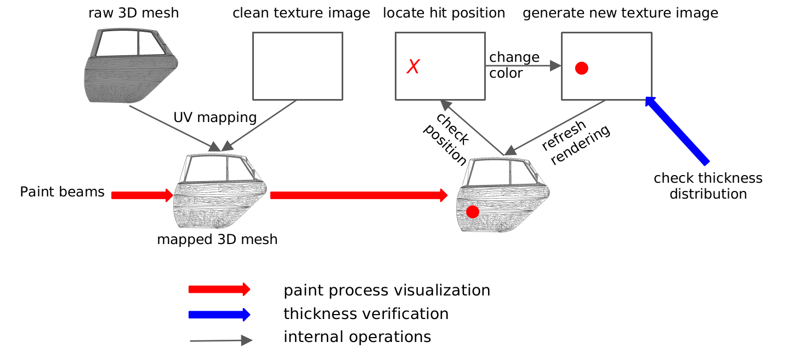
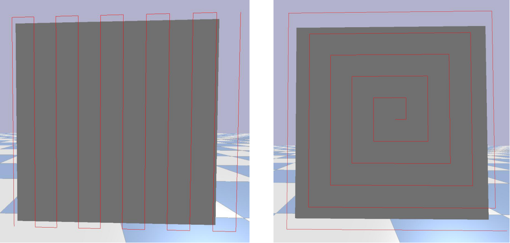

----

<a name="toc"/>

<a href="#introduction">Introduction</a> &middot;
<a href="#motivation">Motivation</a> &middot;
<a href="#disclaimer">Disclaimer</a> &middot;
<a href="#data_generation">Data generation</a> &middot;
<a href="#simulation">Simulation</a> &middot;
<a href="#experiments">Experiments</a> &middot;
<a href="#results">Current results</a> &middot;
<a href="#transfer">Sim2real transfer</a>

----

<a name="introduction"/>
## Introduction <a href="#toc" class="top-link">[Top]</a>

Spray painting is a widely used process for surface treatment especially in the metal industry. The processed parts obtain improved surface properties such as corrosion resistance and electric insulation. As a result of mass production and volatile organic solvents in the paint material, spray painting has been taken over by industrial robots for a long time.

PaintRL is a pure Python framework based on PyBullet, it supports the trajectory planning of industrial spray painting with reinforcement learning in simulation. Besides, classic planning algorithms such as [Andulkar et. al](https://linkinghub.elsevier.com/retrieve/pii/S0278612515000229) and [Chen and Xi](http://link.springer.com/10.1007/s00170-006-0746-5) is also compatible with the framework.

The paint can be further replaced by light via projection mapping to allow sim2real transfer (see <a href="#transfer">Sim2real transfer</a>), which opens up new possibilities to visualize the results from simulation, collect human demonstrations and capture real-world images. 

<a name="motivation"/>
## Motivation <a href="#toc" class="top-link">[Top]</a>

Industry 4.0 requires flexible line production. However, the teaching of the robot trajectory is a trial and error process which relies heavily on the experience of the domain experts. Taken the model below as analysis, trajectories for processing each part of the model should be programmed manually. 

  

In terms of spray painting, the main objective is to achieve uniform coating thickness with minimal material cost and shorter process time. Therefore many paint tools charge the paint material electrostatically and shape the form of the paint with air flow, which introduces several affections such as and gravity field, the speed received of the robot movement, external wind blows, uneven part surface profile. As a result, the trajectory planning for spray painting is still challenging.

The trajectory generation of spray painting has been studied over the last few decades. Beside the two publications mentioned above, the work from [Sheng et al.](http://ieeexplore.ieee.org/document/1458717/) is also widely adopted and cited. However, nowadays the surface of automobiles became more uneven, which makes the simplifications made in those publications less plausible. RL, especially DRL is a promising approach that is capable to solve problems under sophisticated constraints. It is therefore selected to explore the effective trajectory planning of spray painting.

<a name="disclaimer"/>
## Disclaimer <a href="#toc" class="top-link">[Top]</a>

The primary target of this project is to perform trajectory planning and optimization for spray painting in a simulated environment. Since CAD mesh model is available for most industrial parts, it is taken as input of the planning algorithm, while the 6D coordinates of the planned trajectory is the output.

To use the planned trajectory in reality, the robot type could be selected according to the scale of the part and the tool. The reachability could be validated by calculating the inverse kinematics of each point on the trajectory.

<a name="data_generation"/>
## Data Generation <a href="#toc" class="top-link">[Top]</a>

The data used for learning can be generated via interacting with the simulation environment or collected from the real industrial scenario.

In current PaintRL, several efforts were made in improving the sampling efficient. Since the hyperparameters in RL algorithms could be tuned regularly, a quick feedback loop enables effective improvement of the parameter adjustment and thus is a significant factor for a successful learning.

Based on the sim2real transfer (see <a href="#transfer">Sim2real transfer</a>), real-world data can be collected by replacing paint with light by means of images.

<a name="simulation"/>
## Spray painting simulation <a href="#toc" class="top-link">[Top]</a>

The planning system takes the CAD model of the workpiece, the spray tool model, some constraints and optimization criteria as inputs, and outputs the tool trajectory. Each of the components are implemented separately in this framework.

### Tool model

The figure below shows a side view of a paint gun.

  

The profile of the paint can be approximated with a cone. In the implementation, the paint profile is treated as stationary, deformations caused by external conditions will not be considered.

  

It is easy to see that the atomized paint is not distributed uniformly. The beta distribution model from [Balkan and Arikan](https://www.sciencedirect.com/science/article/pii/S0093641399000695) is employed to model the non-uniformity of the paint. An obvious advantage of this model is the flexibility with different gun models and external working conditions. 

  

### Surface model

The triangle mesh model is used to represent the workpieces in the framework. As an example, one door model is shown below. Although inaccurate and excessive in file size, this representation is quick to process, straightforward and easy to analyze.

  

[Wavefront .obj file](https://en.wikipedia.org/wiki/Wavefront_.obj_file) is used as the standard format for mesh model due to its simplicity in both storage (plain text is friendly to process) and content organization. Moreover, the UV coordinate of a mesh object can be stored in one file, this facilitates further simulation operations in the framework. 

### Mapping paint beams to the workpiece

The UV mapping is employed to dress the 3D object surface with a 2D texture image, so as to facilitate the visualization and thickness calculation of spray painting. As can be seen in the figure below, this process takes a raw 3D mesh file and a clean image file as input and yields a mapped 3D mesh object. After this process, the image is associated with the 3D model, and a paint beam can leave its spoor by changing the pixel value of the corresponding texture image.

  

The impact points of paint droplets are calculated with ray-surface intersection tests provided by PyBullet, while the movements are guided by the surface normals of the workpiece.

  

<a name="experiments"/>
## Experiments <a href="#toc" class="top-link">[Top]</a>

The coverage path planning is formalized as a markov decision process (S, A, Pa, Ra) and the [Gym toolkit](https://gym.openai.com/) from OpenAI is employed to formulate the interface for the RL algorithms. Considering the scalability, completeness of the documentation, [Ray RLlib](https://ray.readthedocs.io/en/latest/rllib.html) is selected as the RL training framework in PaintRL.

### Observation:

According to current design of observation, a workpiece can be subdivided into circular sectors relative to the tool center point (TCP) or subdivided into grids. The state is composed of the ratios of unpainted pixels and total pixels in each unit and the TCP position in principle directions of the workpiece. The three different kinds of representations is shown in the figure below.

  

### Actions:

As shown in the figure below, three types of action are defined in PaintRL. They are:

+ Two-dimensional action, each dimension corresponds to an axis coordinate of the workpiece’s principal plane. 
+ One-dimensional action, derived from the 2D version by freezing the step size.
+ Discrete action, simplified from the 1D action by discretizing the directions.

  

### Reward:

The reward is defined proportional to the newly painted pixels in each time step. To prevent the agent from doing some undesired behaviors, several penalties are designed based on the following heuristics:

+ Full coverage with shorter trajectory, time step penalty
+ Keep the paint cone on the workpiece, out of part penalty
+ Prevent unnecessary paint overlap, overlap penalty
+ Prefer a trajectory with less turning, turning penalty

Furthermore, several conditions are introduced as termination signals for the experience sampling. These conditions help to make effective exploration:

+ Out of part termination
+ Limited episode length
+ Average painted pixels in each step

### Baseline:

According to the survey of [Chen et al.](https://ieeexplore.ieee.org/document/4626515), two path patterns are widely used in previous research, namely the zigzag pattern and the spiral pattern (shown in the figure below). However, the spiral path performs poorly in terms of achieving the uniform coat thickness due to the discontinuous paint deposition during the turning of the spray tool.

  

Both of the path patterns can be programmed as baseline. In our current experiment, we took the zigzag pattern as the baseline.

<a name="results"/>
## Current achieved results <a href="#toc" class="top-link">[Top]</a>

In the experiment, Proximal Policy Optimization (PPO) with four discrete actions (move up, left, down, right) was used to train a fully connected neural network consisting of two hidden layers with 256 and 128 neurons. After training the networks for two million steps on a car door and a quadratic sheet, the achieved coverage ratio and episode length ratio are shown in the figure below. For both workpieces, 235 action steps are required to achieve full coverage with the baseline.

  

The video below is a rollout of the learned policy on the car door.

<iframe width="853" height="480" src="https://www.youtube-nocookie.com/embed/TadnJeuAY6I?rel=0" frameborder="0" allow="accelerometer; autoplay; encrypted-media; gyroscope; picture-in-picture" allowfullscreen></iframe>

<a name="transfer"/>
## Sim2real transfer <a href="#toc" class="top-link">[Top]</a>

We use the projection mapping software [Splash](https://github.com/paperManu/splash) to transfer the results from simulation to a real car door. In terms of the hardware, an ultra short throw projector is required in order to avoid shadowing. The transfer is demonstrated with the video below.

<iframe width="853" height="480" src="https://www.youtube-nocookie.com/embed/nJVLpEk1MOs?rel=0" frameborder="0" allow="accelerometer; autoplay; encrypted-media; gyroscope; picture-in-picture" allowfullscreen></iframe>

In future work, we intend to use projection mapping to gather human demonstrations by guiding the end effector of a robot and capture real-world images to learn a policy from pictures rather than a low-dimensional observation. 
